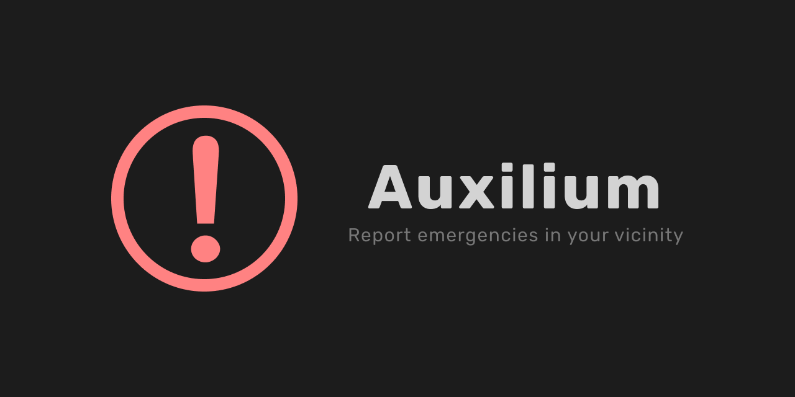

# [](https://overt.dev)

Auxilium is an open-source app for reporting emergencies. It informs nearby users that an emergency has occured in their vicinity, and provides them with the location (and directions), to keep them informed, and take neccessary actions.

## Motivation

In [my country](https://en.wikipedia.org/wiki/Nigeria), many people die because of inability to access help quickly when they are involved in accidents or emergencies. I've always believed that many of these mortalities could have been averted, if people around would have come to their aid.

## Project Phase

This project is currently in the _pre-launch_ phase, being developed by [Oluwakorede Fashokun](https://github/com/koredefashokun) and [members of the Overt community](https://discord.gg/t6wVzUh) for [Overt](https://overt.dev), a concept that creates open-source software to solve many of the problems we face in the world. You can read more [here](https://medium.com/@koredefashokun/building-the-future-in-the-open-f3ac035fb412), or follow Overt on Twitter [here](https://twitter.com/overt_hq).

## Project Ideas

You can share your ideas for the project in the [Overt Discord server](https://discord.gg/t6wVzUh). You can also create feature requests as issues on this GitHub repository.

## Installation

This section will help you get Auxilium up and running in your development environment.

### Prerequisites

Before starting installing, the following are required:

- [Node.js](https://nodejs.org) (version 8 or higher).
- [Yarn](https://yarnpkg.com) (version 1.22 or lower)
- [MongoDB](https://mongodb.com) (database for local development)

### Commands

Note that reading the package-specific docs is crucial to get Auxilium up and running locally.
You can check each of the packages in the `packages` folder for their respective READMEs.

To install Auxilium on your machine, run these commands:

```sh
# Clone the repository
git clone https://github.com/overthq/Auxilium.git

# Move into the project directory
cd Auxilium

# Install dependencies
yarn
cd packages/server && yarn

# SERVER-SIDE (Be sure to read the server docs)

# Start MongoDB

# Start the backend server (after including the necessary vars in the server's .env file)
yarn dev:server

# CLIENT-SIDE

# Start the Expo app
yarn dev:app
```

## Contributing

All forms of (positive) contribution is welcome to Auxilium. Be sure to check out the [contribution guidelines](.github/CONTRIBUTING.md) before contributing.

## Tech Stack

Auxilium is a JavaScript-based application. It is built with popular JS libraries/frameworks like React, React Native and Express. Here's what the stack looks like.

- Front-End
  - Mobile App
    - Framework: [React Native](https://facebook.github.io/react-native) based on [Expo](https://expo.io)
  - Dashboard (not in active development)
    - Library: [React](https://facebook.github.io/react) based on [Create React App](https://facebook.github.io/create-react-app)
- Back-End
  - Framework: [Express](https://expressjs.com)
  - Database: [MongoDB](https://mongodb.com)
  - Hosting: [Heroku](https://heroku.com)

The continuous integration/deployment (CI/CD) on this project is handled with [GitHub Actions](https://github.com/actions).

## License

GNU GPLv3 License

## Author

Oluwakorede Fashokun (<korede@overt.dev>) for [Overt](https://overt.dev).
